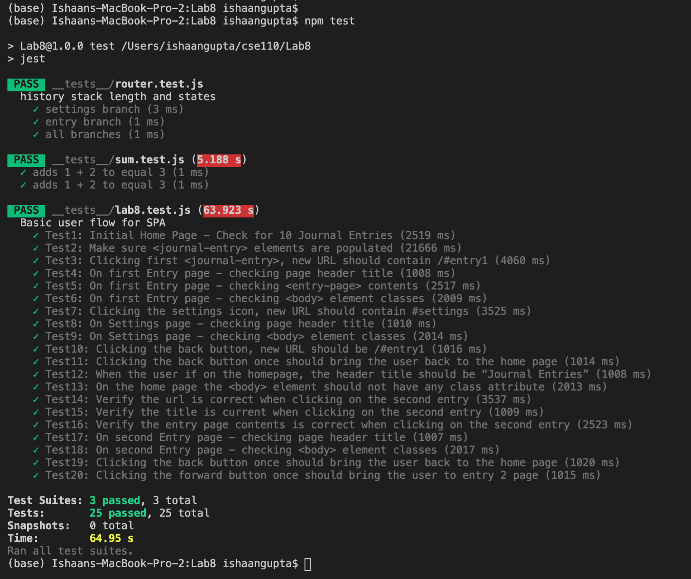

# Lab8_Starter
Submitted by Ishaan Gupta
## Check your understanding q's (FILL OUT)
1. In your own words: Where would you fit your automated tests in your Bujo project development pipeline? (just write the letter)
   - 1
2. Would you use a unit test to test the “message” feature of a messaging application? Why or why not? For this question, assume the “message” feature allows a user to write and send a message to another user.
   - No because "message" is not a simple independent feature that we can make a unit test for, it is the result of a combination of features that we can build unit tests for individually. We would rather use end-to-end testing here.
3. Would you use a unit test to test the “max message length” feature of a messaging application? Why or why not? For this question, assume the “max message length” feature prevents the user from typing more than 80 characters
    - Yes, since this is a simple component that be tested individually by attempting to input a message longer than 80 characters and checking for truncation or error whatver the intended behavior to handle it is.
4. What do you expect to happen if we run our puppeteer tests with the field “headless” set to true?
    -  Puppeteer will run the tests without a browser UI, so we won't see a browser window physically opening as the tests run.
5. What would your beforeAll callback look like if you wanted to start from the settings page before every test case?

  ```javascript 
    beforeAll(async () => {
    await page.goto('http://127.0.0.1:5500');
    await page.click('header > img');
    await page.waitForTimeout(500);
  }); 
  ```

